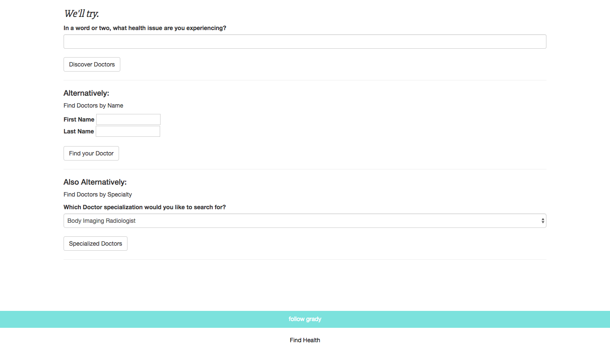

# _Doctor Discovery_


* Visit the site https://gravytates.github.io/doctor_discovery
* A website backed with the power of the [BetterDoctor API](https://developer.betterdoctor.com/) that allows users to search for doctors based on condition, name, or specialization. Using object oriented Javascript and Node.js, there is a full front to back end separation of logic. App includes doctor profiles, pictures, addresses and phone numbers.  

### Prerequisites

* Web browser with ES6 compatibility
* Examples: Chrome, Safari

* Ruby 2.3.1 (for SCSS)
* Node Package Manager (npm)
* Bower

### Setup/Installation Requirements

* If you would like to clone this app to your local machine, download this repository at https://github.com/gravytates/doctor_discovery.git
* Open in desktop
* Run:
```
$ npm install
```

```
$ bower install
```
```
$ bower init
```
```
$ bower install jquery --save
```
```
$ touch .env
```
* You will need an access key from the BetterDoctor API website [(found here)](https://developer.betterdoctor.com/). Inside the .env file, write:
```
exports.apiKey = "YOUR KEY HERE";
```
* Now back in the terminal, run:

```
$ gulp build --production
```
```
$ gulp serve
```

## Screenshots

**Forms:**


**Doctor Profiles:**


## Built With

* HTML
* CSS
* Bootstrap https://getbootstrap.com/
* ES6
* Jquery https://jquery.com/
* Node
* Bower

## Authors

* Grady Shelton

## License

MIT License

Copyright (c) Grady Shelton

Permission is hereby granted, free of charge, to any person obtaining a copy
of this software and associated documentation files (the "Software"), to deal
in the Software without restriction, including without limitation the rights
to use, copy, modify, merge, publish, distribute, sublicense, and/or sell
copies of the Software, and to permit persons to whom the Software is
furnished to do so, subject to the following conditions:

The above copyright notice and this permission notice shall be included in all
copies or substantial portions of the Software.

THE SOFTWARE IS PROVIDED "AS IS", WITHOUT WARRANTY OF ANY KIND, EXPRESS OR
IMPLIED, INCLUDING BUT NOT LIMITED TO THE WARRANTIES OF MERCHANTABILITY,
FITNESS FOR A PARTICULAR PURPOSE AND NON-INFRINGEMENT. IN NO EVENT SHALL THE
AUTHORS OR COPYRIGHT HOLDERS BE LIABLE FOR ANY CLAIM, DAMAGES OR OTHER
LIABILITY, WHETHER IN AN ACTION OF CONTRACT, TORT OR OTHERWISE, ARISING FROM,
OUT OF OR IN CONNECTION WITH THE SOFTWARE OR THE USE OR OTHER DEALINGS IN THE
SOFTWARE.
